# Mocktool

Mocktool is a simple tool written in the Go language. It supports controlling API responses based on feature scenarios.

## Technologies

```bash
- mongoDB: "go.mongodb.org/mongo-driver/mongo"
- echo: "github.com/labstack/echo/v4"
- Hash: "crypto/sha256"
- Monitoring: "github.com/prometheus/client_golang/prometheus"
- Redis: "github.com/go-redis/redis/v8"
- grpc: "google.golang.org/grpc"
- validator: "github.com/go-playground/validator/v10"
- Unittest: "go.uber.org/mock/gomock" - coverage: 87.5% of statements
```

## Problem Statement

During software development, you may encounter bottlenecks where:
- Frontend developers and testers must wait for backend developers to provide APIs or finalize responses.
- Backend APIs change during development, requiring frontend code updates.
- Mocking solutions are limited to hardcoding responses by URL path, without request body filtering.
- Multiple stakeholders cannot work in parallel (for example: FE completes development but lacks test data, or QA cannot set up edge cases for testing).

=> That is exactly pain point in development. However, the tools currently available on the market only allow hardcoding responses based on URL paths, and do not allow filtering by requestBody. This tool allows FE and testers to control the process without needing support from the BE.

## Pros and cons

### Pros
- FE no need modify code when call API. BE can controll
- Multiple stackholder can work paralell
- Multiple active scenarios base on account_id
- Dynamic API response base on path + method + hash of request body

### Cons
- Need define correct API contract at the first time

# Architecture

## Architecture Diagram

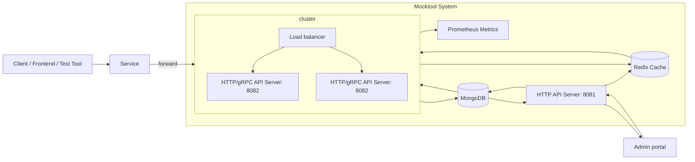
```mermaid
flowchart LR
    Admin[Admin portal]
    Client[Client / Frontend / Test Tool]
    Service
    subgraph Mocktool System
        API1[HTTP API Server: 8081]
        subgraph cluster
            LB[Load balancer]
            API2[HTTP/gRPC API Server: 8082]
            API3[HTTP/gRPC API Server: 8082]
        end
        Metrics[Prometheus Metrics]
        Cache[(Redis Cache)]
        DB[(MongoDB)]
    end
    
    Admin --> API1
    API1 --> DB
    DB --> API1
    API1 --> Admin
    API1 --> Cache

    Client --> Service
    Service --forward--> cluster 
    LB --> API2
    LB --> API3
    cluster --> Cache
    Cache --> cluster
    
    cluster --> DB
    DB --> cluster
    cluster --> Metrics
```

<summary>
<details>

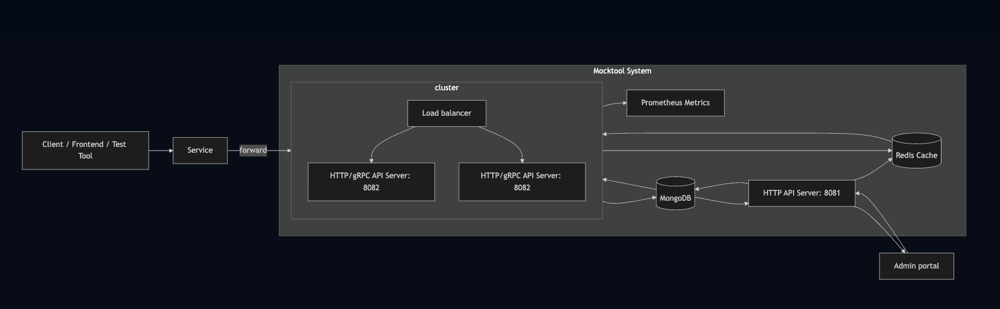

</details>
</summary>

## Architecture Explanation

### Write
```
Request
  ↓
Update / remove
  ↓
Cache invalid
  ↓
Store result in MongoDB
  ↓
Return response
```
### Read

```
Request
  ↓
Check Redis cache
  ↓
Cache hit → return immediately
  ↓
Cache miss → query MongoDB
  ↓
Store result in Redis
  ↓
Return response
```

## Usecases

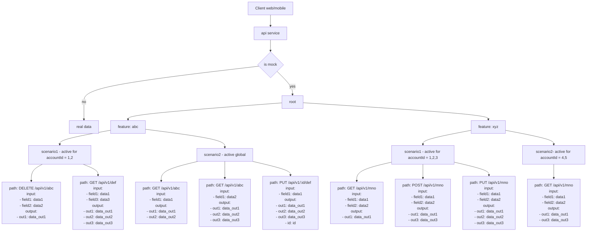
```mermaid
flowchart TB
    Client[Client web/mobile] --> API[api service]

    API --> ISMOCK{is mock}
    ISMOCK -- no ---> REAL[real data]
    ISMOCK -- yes --> ROOT[root]


    %% Feature abc
    ROOT --> ABC[feature: abc]
    ABC --> ABC_S1[scenario1 - active for accountId = 1,2]
    ABC --> ABC_S2[scenario2 - active global]

    ABC_S1 --> ABC_S1_P1["path: DELETE /api/v1/abc<br/>input:<br/>- field1: data1<br/>- field2: data2<br/>output:<br/>- out1: data_out1"]
    ABC_S1 --> ABC_S1_P2["path: GET /api/v1/def<br/>input:<br/>- field1: data1<br/>- field3: data3<br/>output:<br/>- out1: data_out1<br/>- out2: data_out2<br/>- out3: data_out3"]

    ABC_S2 --> ABC_S2_P1["path: GET /api/v1/abc<br/>input:<br/>- field1: data1<br/>output:<br/>- out1: data_out1<br/>- out2: data_out2"]
    ABC_S2 --> ABC_S2_P2["path: GET /api/v1/abc<br/>input:<br/>- field1: data2<br/>output:<br/>- out1: data_out1<br/>- out2: data_out2<br/>- out3: data_out3"]
    ABC_S2 --> ABC_S2_P3["path: PUT /api/v1/:id/def<br/>input:<br/>- field1: data1<br/>output:<br/>- out1: data_out1<br/>- out2: data_out2<br/>- out3: data_out3<br/>- id: id"]

    %% Feature xyz
    ROOT --> XYZ[feature: xyz]
    XYZ --> XYZ_S1[scenario1 - active for accountId = 1,2,3]
    XYZ --> XYZ_S2[scenario2- active for accountId = 4,5]

    XYZ_S1 --> XYZ_S1_P1["path: GET /api/v1/mno<br/>input:<br/>- field1: data1<br/>- field2: data2<br/>output:<br/>- out1: data_out1"]
    XYZ_S1 --> XYZ_S1_P2["path: POST /api/v1/mno<br/>input:<br/>- field1: data1<br/>- field2: data2<br/>output:<br/>- out1: data_out1<br/>- out3: data_out3"]
    XYZ_S1 --> XYZ_S1_P3["path: PUT /api/v1/mno<br/>input:<br/>- field1: data1<br/>- field2: data2<br/>output:<br/>- out1: data_out1<br/>- out2: data_out2<br/>- out3: data_out3"]

    XYZ_S2 --> XYZ_S2_P1["path: GET /api/v1/mno<br/>input:<br/>- field1: data1<br/>- field2: data2<br/>output:<br/>- out1: data_out1<br/>- out3: data_out3"]

```

<summary>
<details>

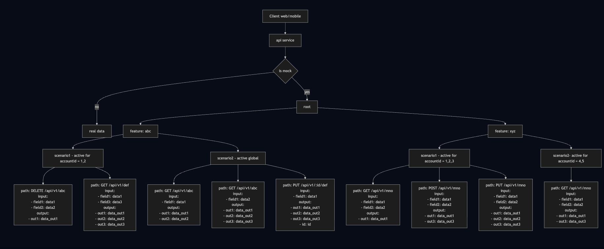

</details>
</summary>

## Sequence diagram


<summary>
<details>
title Mocktool

participant FE
participant BE-service
participant real-service
participant mock-service

FE->BE-service: request (/api/v1/insert)
alt is mock data?
BE-service->BE-service: add suffix /forward (/forward/api/v1/insert)
BE-service->mock-service: send request (/forward/api/v1/insert)
mock-service->mock-service: find by featureName and active scenario by accountId
mock-service--> BE-service: response
BE-service-->FE: response
else

BE-service->real-service: call final BE
real-service-->BE-service: response
BE-service-->FE: response
end
</details>
</summary>

## Design Tradeoffs Explanation

<summary>
<details>

### Redis vs Direct Database Access
```
Choice: Use Redis cache layer
Benefits:
- reduces database load
- improves response latency
- improves scalability

Tradeoff:
- cache invalidation complexity
- additional infrastructure

Decision:
Redis chosen to improve performance and scalability.
```
---

### Cache-aside vs Write-through
```
Choice: Cache-aside combine Write-through pattern

Benefits:
- simple implementation
- flexible caching

Tradeoff:
- first request slightly slower (cache miss)

Decision:
Cache-aside chosen for simplicity and flexibility.
Write-through chosen for invalide cache when have any updating
```
---

### MongoDB vs SQL
```
Choice: MongoDB

Benefits:
- flexible schema
- easier iteration
- fast reads

Tradeoff:
- weaker relational guarantees

Decision:
MongoDB suitable for flexible mock configuration storage.
```
---

### HTTP + gRPC Support
```
Choice: support both protocols

Benefits:
- flexibility
- supports modern backend architectures

Tradeoff:
- increased code complexity

Decision:
gRPC added to support high-performance internal communication.
```

### Rate limit: Slide window vs Leaky Bucket
```
Choice: support both protocols

Benefits:
- simpler implementation
- good fairness
- sufficient accuracy for API limiting

Sliding window chosen for better fairness.
```

</details>
</summary>

## Performance benchmark

```
hey -n 10000 -c 100 http://localhost:8082/mock/test

Summary:
  Total:        0.2252 secs
  Slowest:      0.0188 secs
  Fastest:      0.0001 secs
  Average:      0.0022 secs
  Requests/sec: 44398.8287
  
  Total data:   240000 bytes
  Size/request: 24 bytes

Response time histogram:
  0.000 [1]     |
  0.002 [6532]  |■■■■■■■■■■■■■■■■■■■■■■■■■■■■■■■■■■■■■■■■
  0.004 [2220]  |■■■■■■■■■■■■■■
  0.006 [674]   |■■■■
  0.008 [231]   |■
  0.009 [112]   |■
  0.011 [70]    |
  0.013 [34]    |
  0.015 [27]    |
  0.017 [68]    |
  0.019 [31]    |


Latency distribution:
  10%% in 0.0005 secs
  25%% in 0.0009 secs
  50%% in 0.0014 secs
  75%% in 0.0026 secs
  90%% in 0.0043 secs
  95%% in 0.0062 secs
  99%% in 0.0150 secs
```

# Features

## 1. Multiple active feature at the same time

The feature_name is control by `api-service`. Which support multiple services work at the same time.
```go
// Service 1
targetURL := "http://localhost:8082/forward" + c.Request().RequestURI

// Service 2
targetURL := "http://localhost:8082/forward" + c.Request().RequestURI 

// parse accountId from token
accountId := 1
forwardReq.Header.Set("Content-Type", "application/json")
forwardReq.Header.Set("X-Feature-Name", "feature2")
forwardReq.Header.Set("X-Account-Id", accountId)
```

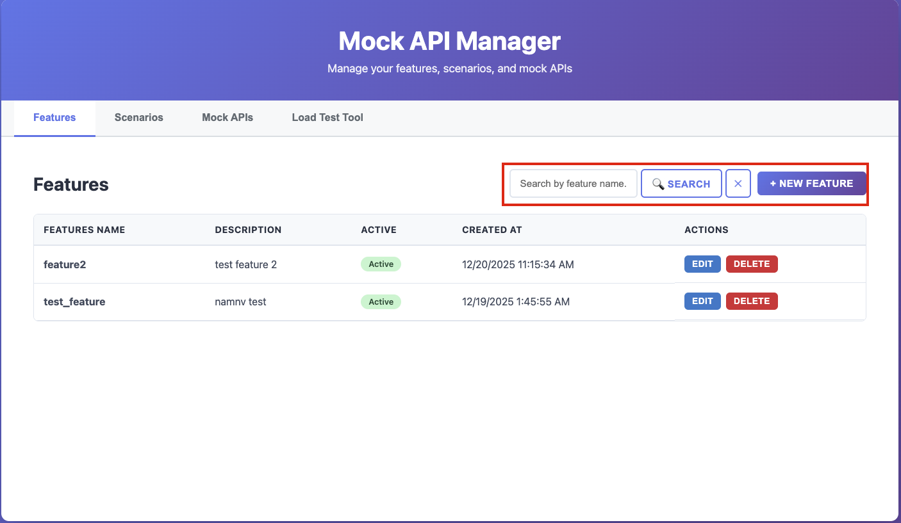

## 2. Only 1 active scenario for each feature for each accountId

- If I active a another scenario of a feature, the actived scenarios will deactive
- Reusable because all scenario is shared
- Setup globally scenario => All accountIds will have the same result
- If I don't want use global scenario. I can active another, other account will still keep thier active scenario

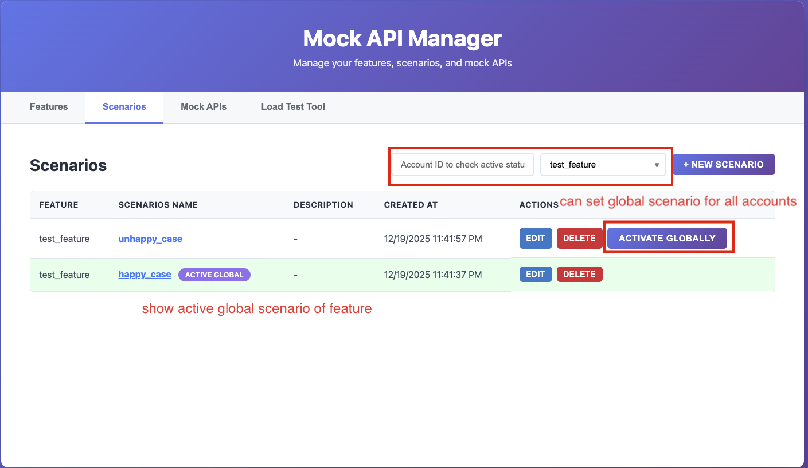

Can re-active global scenario by account_id

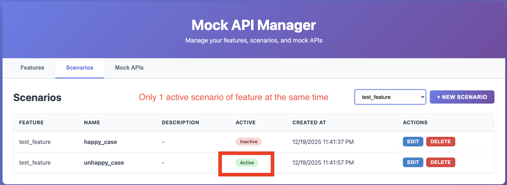
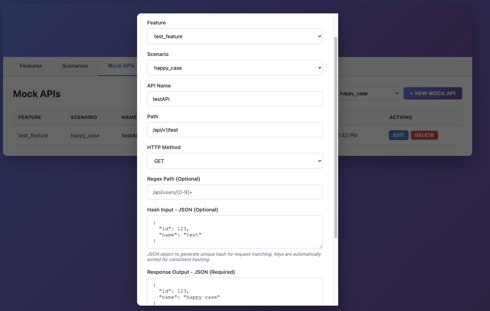

Cache in Redis with template: `mocktool:<feature>:<scenario>:<account_id>:<path>:<method>:<hash_input>`

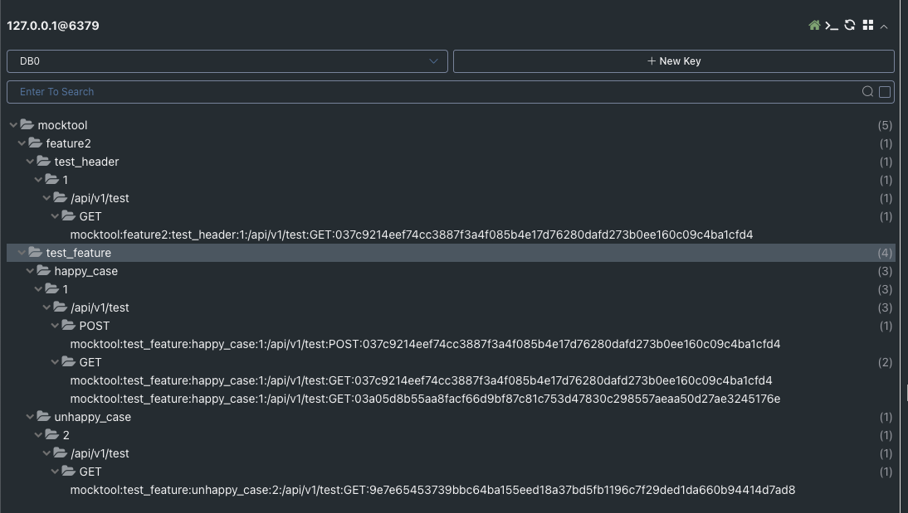

=> Make sure 1 API can response expecting answer for a accountId

=> Multiple platform can develop parrallelly. 1 account for IOS with scenario1, 1 account for ANDROID with scenario2, 1 account for QC to write automation testing.

## 3. Multiple APIs for each scenario 

The key point is combination of: Path + Method + requestBody

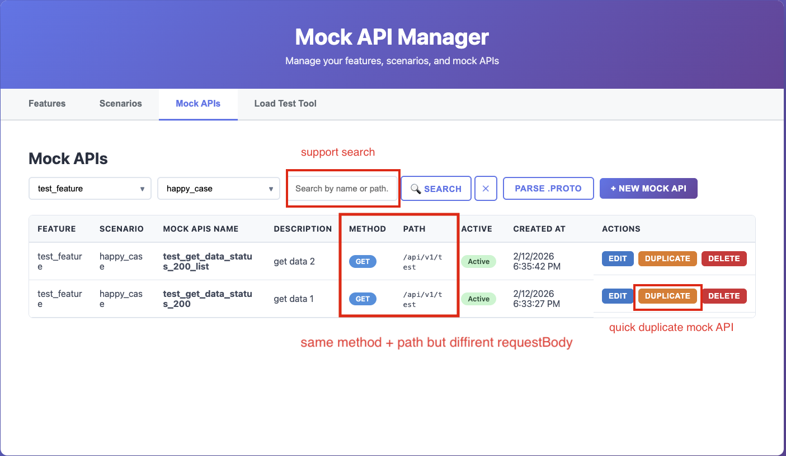
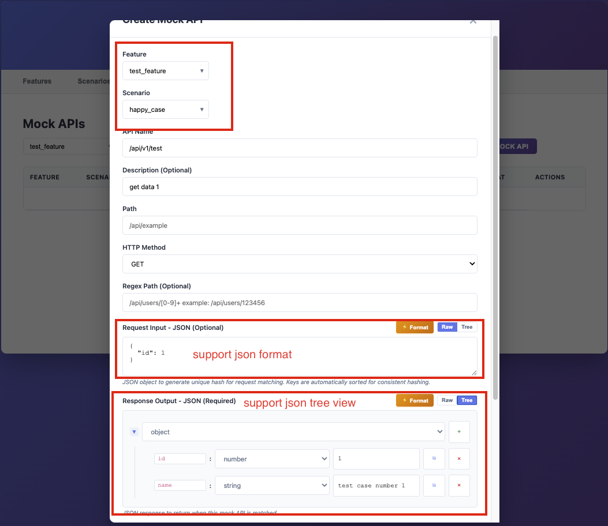
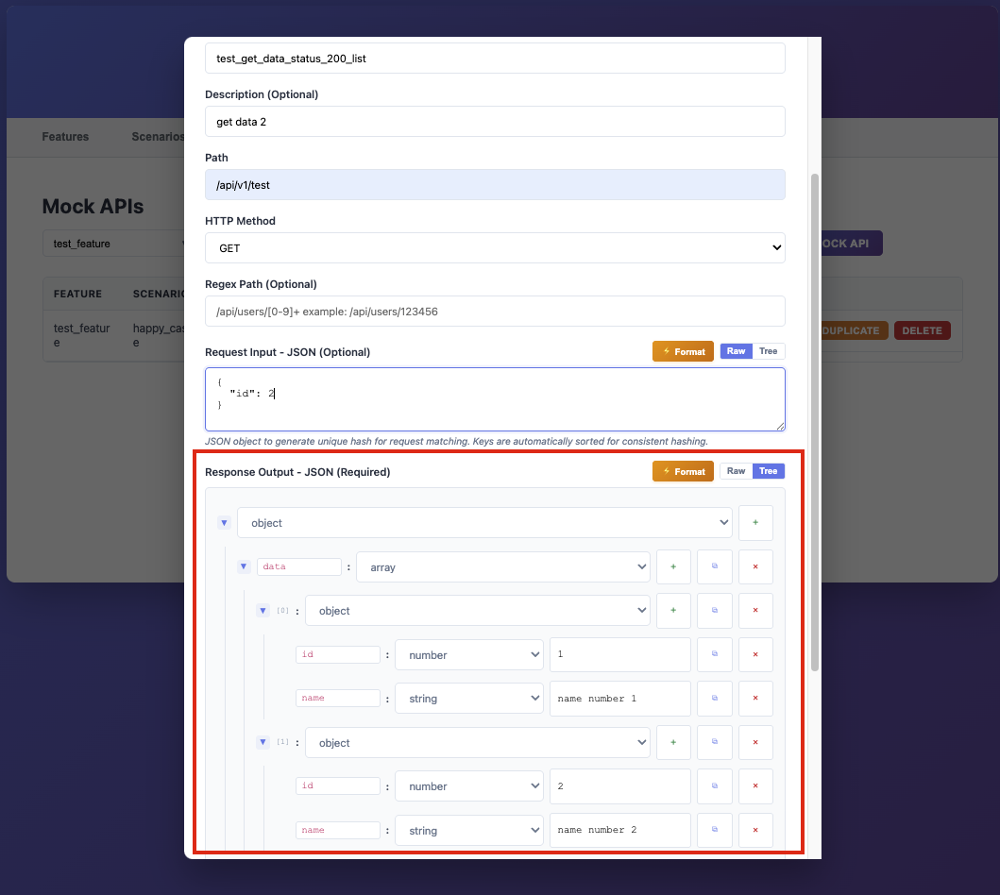

DB 
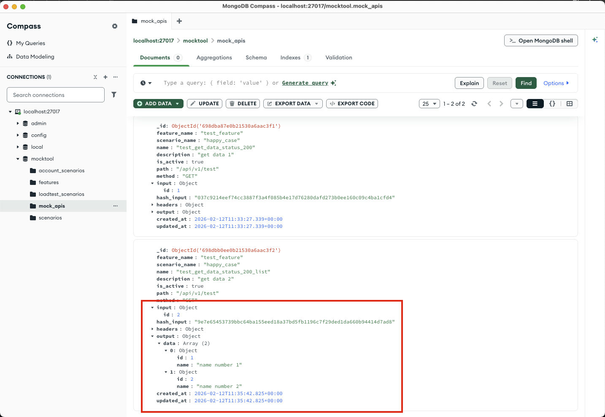

### result

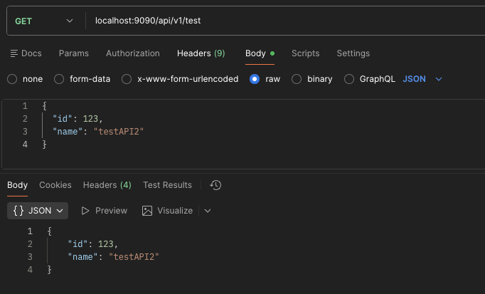
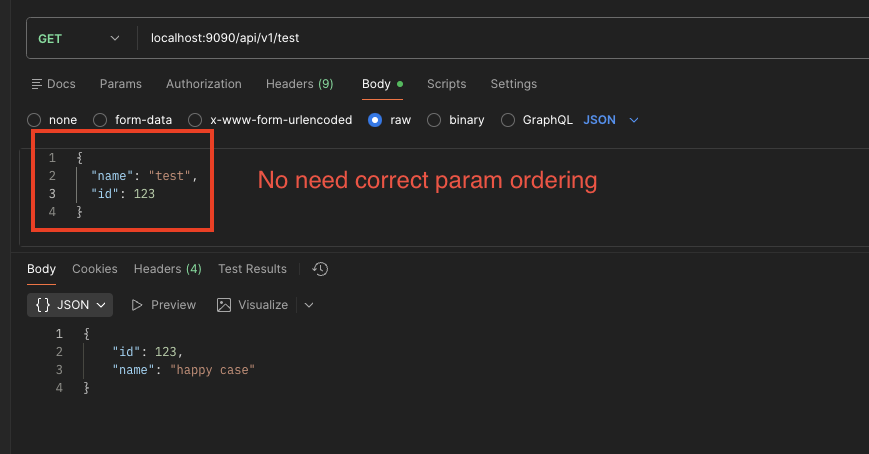

response with headers

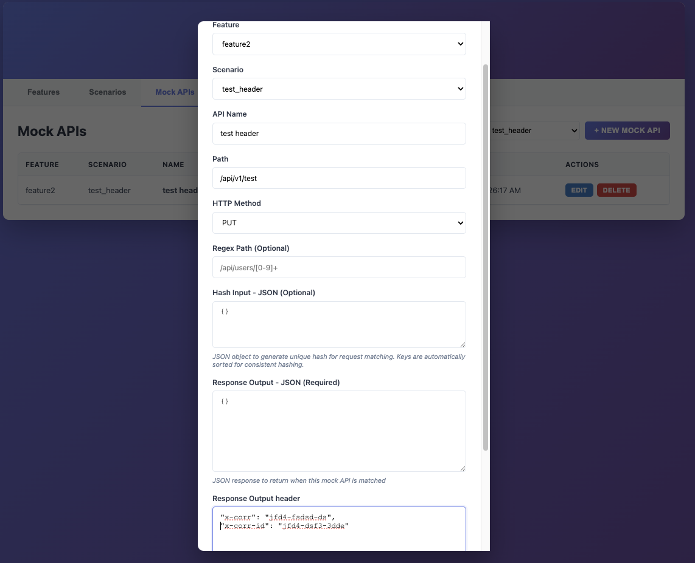
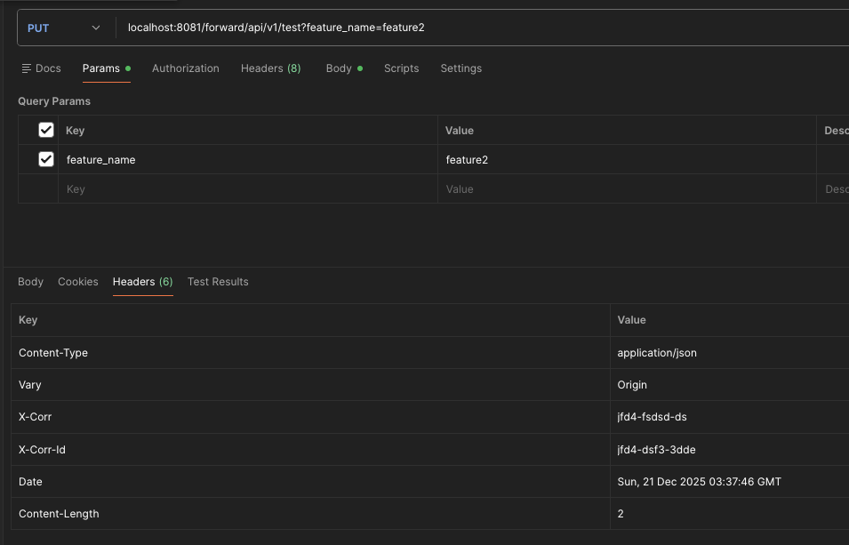
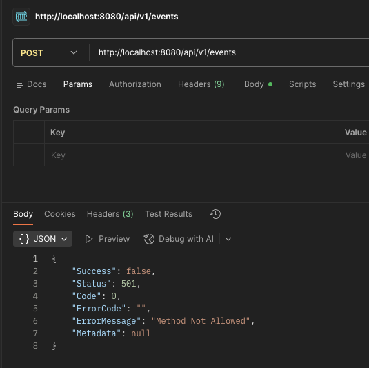

## 4. Load test feature (Bonus)

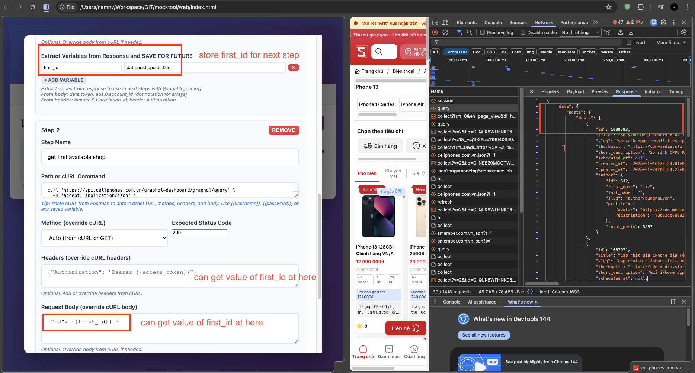

You can run test scenario

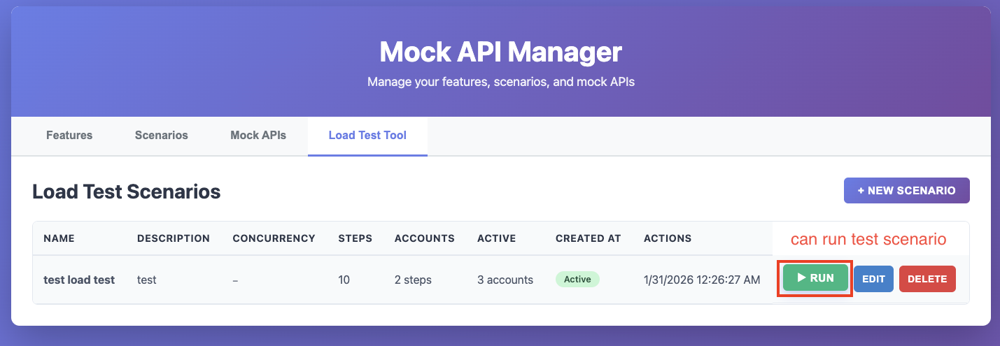

example at `/doc/mocktool.loadtest_scenarios.json`

result

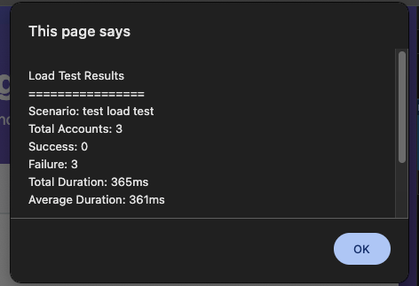

# How to start

```bash
# start docker

docker compose up -d

# Start server
go run main.go service

# start UI with browser
http://localhost:8081/
# use command run: open web/index.html

# start your service client
# example http server

go run ./example/http/main.go

# start your service client
# example grpc gatway server

go run ./example/grpc/main.go 
```

Ref: [example http](./example/http/README.md)
Ref: [example grpc](./example/grpc/README.md)


## Build errorResponse

```bash
go install google.golang.org/protobuf/cmd/protoc-gen-go@latest
go install google.golang.org/grpc/cmd/protoc-gen-go-grpc@latest

protoc --go_out=pkg/generated --go-grpc_out=pkg/generated pkg/errorcustome/error_detail.proto
```

```go
return nil, errorcustome.NewError(codes.Internal, "ERR.001", "Forward error: %s", metadata, string(b))

// Example
{
    "success": false,
    "http_status": 500,
    "grpc_code": 13,
    "error_code": "ERR.001",
    "error_message": "Forward error: Internal Server Error",
    "details": {
        "x-trace-id": "jk3k49-234kfd934-fdk239d3-dk93dk3-d"
    },
    "trace_id": "jk3k49-234kfd934-fdk239d3-dk93dk3-d"
}
```

