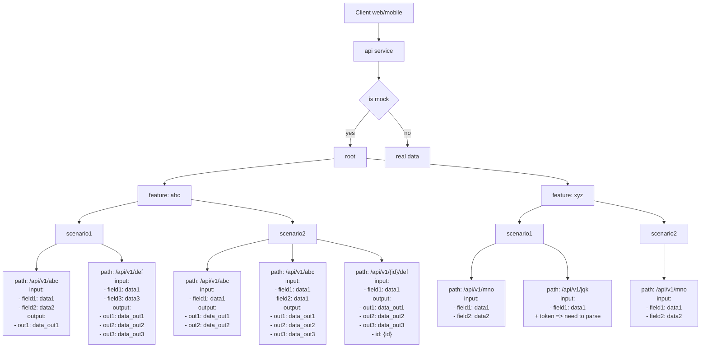
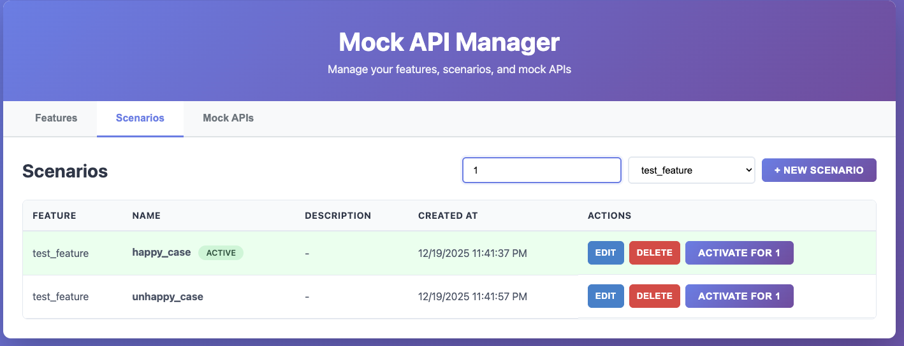
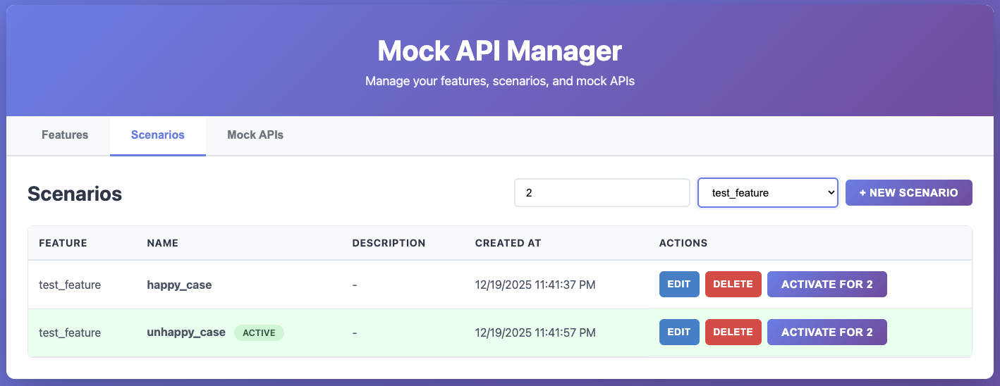

# Mocktool

Mocktool is a simple tool written in the Go language. It supports controlling API responses based on feature scenarios.

During software development, you may encounter bottlenecks where you have to wait for backend developers (BE) to provide APIs or responses to frontend developers (FE) or testers. However, the tools currently available on the market only allow hardcoding responses based on URL paths, and do not allow filtering by requestBody. This tool allows FE and testers to control the process without needing support from the BE.

At the same time we have:
- Multiple active feature
- Only 1 active scenario for each feature for each accountId
- Multiple API for each scenario (same API path but different requestBody)



<!--  -->


<summary>
<details>
title Mocktool

participant FE
participant BE-service
participant real-service
participant mock-service

FE->BE-service: request (/api/v1/insert)
alt is mock data?
BE-service->BE-service: add suffix /forward (/forward/api/v1/insert)
BE-service->mock-service: send request (/forward/api/v1/insert)
mock-service->mock-service: find usecase
mock-service--> BE-service: response
BE-service-->FE: response
else

BE-service->real-service: call final BE
real-service-->BE-service: response
BE-service-->FE: response
end
</details>
</summary>

# Pros and cons

## Pros
- FE no need modify code when call API. Only need to modify on BE
- Dynamic scenarios

## Cons
- Need define correct API contract at the first time
- Need define all usecase

# Multiple active feature at the same time

The feature_name is control by `api-service`. Which support multiple services work at the same time.
```go
// Service 1
targetURL := "http://localhost:8081/forward" + c.Request().RequestURI + "?feature_name=test_feature"

// Service 2
targetURL := "http://localhost:8081/forward" + c.Request().RequestURI + "?feature_name=featur2"
```


# Only 1 active scenario for each feature for each accountId

- If I add new scenario of a feature, that new scenario will active and deactive others.
- If I active a existed scenario of a feature. others scenarios will deactive
- Reusable because all scenario is shared
- Setup globally scenario => All accountIds will have the same result




=> Make sure 1 API can response expecting answer for a accountId

=> Multiple platform can develop parrallelly. 1 account for IOS with scenario1, 1 account for ANDROID with scenario2, 1 account for QC to write automation testing.

# Multiple APIs for each scenario 

An API path with different request body will have different response by hashing requestBody


## result


response with headers


# How to start

```bash
# start docker

docker compose up -d

# Start server
go run main.go service

# start UI
open web/index.html

# start your service client
# example http server

go run ./example/http/main.go

# start your service client
# example grpc gatway server

go run ./example/grpc/main.go 
```

Ref: [example http](./example/http/README.md)
Ref: [example grpc](./example/grpc/README.md)

# Technologies

```bash
- Trie algorythm
- mongoDB: "go.mongodb.org/mongo-driver/mongo"
- echo: "github.com/labstack/echo/v4"
```
