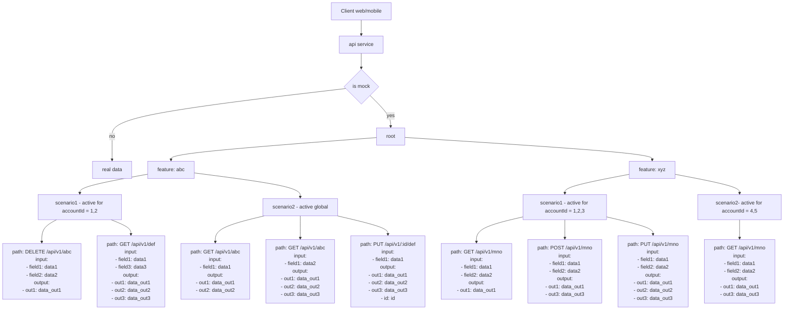

# Mocktool

Mocktool is a simple tool written in the Go language. It supports controlling API responses based on feature scenarios.

## Problem Statement

During software development, you may encounter bottlenecks where:
- Frontend developers and testers must wait for backend developers to provide APIs or finalize responses.
- Backend APIs change during development, requiring frontend code updates.
- Mocking solutions are limited to hardcoding responses by URL path, without request body filtering.
- Multiple stakeholders cannot work in parallel (for example: FE completes development but lacks test data, or QA cannot set up edge cases for testing).

That is exactly pain point in development. However, the tools currently available on the market only allow hardcoding responses based on URL paths, and do not allow filtering by requestBody. This tool allows FE and testers to control the process without needing support from the BE.

## Key Features

This tool provides the following capabilities:

- Multiple active features
- Multiple scenarios of a features
- Only 1 active scenario for each feature for each accountId
- Multiple APIs for each scenario (same API path with different request bodies distinguished by hash)



<summary>
<details>


</details>
</summary>


<summary>
<details>
title Mocktool

participant FE
participant BE-service
participant real-service
participant mock-service

FE->BE-service: request (/api/v1/insert)
alt is mock data?
BE-service->BE-service: add suffix /forward (/forward/api/v1/insert)
BE-service->mock-service: send request (/forward/api/v1/insert)
mock-service->mock-service: find by featureName and active scenario by accountId
mock-service--> BE-service: response
BE-service-->FE: response
else

BE-service->real-service: call final BE
real-service-->BE-service: response
BE-service-->FE: response
end
</details>
</summary>

# Technologies

```bash
- mongoDB: "go.mongodb.org/mongo-driver/mongo"
- echo: "github.com/labstack/echo/v4"
- Hash: "crypto/sha256"
- Monitoring: "github.com/prometheus/client_golang/prometheus"
- Redis: "github.com/go-redis/redis/v8"
- grpc: "google.golang.org/grpc"
- validator: "github.com/go-playground/validator/v10"
- Unittest: "go.uber.org/mock/gomock" - coverage: 87.5% of statements
```

# Pros and cons

## Pros
- FE no need modify code when call API. Only need to modify on BE
- Dynamic scenarios

## Cons
- Need define correct API contract at the first time
- Need define all usecase

# Multiple active feature at the same time

The feature_name is control by `api-service`. Which support multiple services work at the same time.
```go
// Service 1
targetURL := "http://localhost:8082/forward" + c.Request().RequestURI

// Service 2
targetURL := "http://localhost:8082/forward" + c.Request().RequestURI 

// parse accountId from token
accountId := 1
forwardReq.Header.Set("Content-Type", "application/json")
forwardReq.Header.Set("X-Feature-Name", "feature2")
forwardReq.Header.Set("X-Account-Id", accountId)
```


# Only 1 active scenario for each feature for each accountId

- If I add new scenario of a feature, that new scenario will active and deactive others.
- If I active a existed scenario of a feature. others scenarios will deactive
- Reusable because all scenario is shared
- Setup globally scenario => All accountIds will have the same result


Can re-active global scenario by account_id


Cache in Redis with template: `mocktool:<feature>:<scenario>:<account_id>:<path>:<method>:<hash_input>`


=> Make sure 1 API can response expecting answer for a accountId

=> Multiple platform can develop parrallelly. 1 account for IOS with scenario1, 1 account for ANDROID with scenario2, 1 account for QC to write automation testing.

# Multiple APIs for each scenario 

An API path with different request body will have different response by hashing requestBody


DB 


## result


response with headers


# How to start

```bash
# start docker

docker compose up -d

# Start server
go run main.go service

# start UI
open web/index.html

# start your service client
# example http server

go run ./example/http/main.go

# start your service client
# example grpc gatway server

go run ./example/grpc/main.go 
```

Ref: [example http](./example/http/README.md)
Ref: [example grpc](./example/grpc/README.md)


## Build errorResponse

```bash
go install google.golang.org/protobuf/cmd/protoc-gen-go@latest
go install google.golang.org/grpc/cmd/protoc-gen-go-grpc@latest

protoc --go_out=pkg/generated --go-grpc_out=pkg/generated pkg/errorcustome/error_detail.proto
```

```go
return nil, errorcustome.NewError(codes.Internal, "ERR.001", "Forward error: %s", metadata, string(b))

// Example
{
    "success": false,
    "http_status": 500,
    "grpc_code": 13,
    "error_code": "ERR.001",
    "error_message": "Forward error: Internal Server Error",
    "details": {
        "x-trace-id": "jk3k49-234kfd934-fdk239d3-dk93dk3-d"
    },
    "trace_id": "jk3k49-234kfd934-fdk239d3-dk93dk3-d"
}
```

# Load test feature


You can run test scenario


example at `/doc/mocktool.loadtest_scenarios.json`

result


