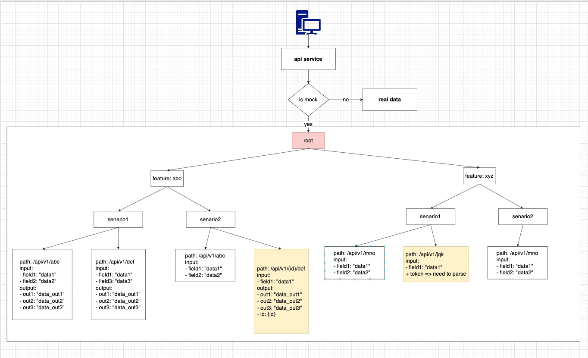

# Mocktool

Mocktool is a simple tool written in the Go language. It supports controlling API responses based on feature scenarios.

During software development, you may encounter bottlenecks where you have to wait for backend developers (BE) to provide APIs or responses to frontend developers (FE) or testers. This tool allows FE and testers to control the process without needing support from the BE.

At the same time we have:
- Multiple active feature
- Only 1 active scenario for each feature
- Multiple API for each scenario (same API path but different requestBody)



# Pros and cons

## Pros
- FE no need modify code when call API. Only need to modify on BE
- Dynamic scenarios

## Cons
- Need define correct API contract at the first time
- Need define all usecase


# Multiple active feature at the same time

The feature_name is control by `api-service`. Which support multiple services work at the same time.
```go
// Service 1
targetURL := "http://localhost:8081/forward" + c.Request().RequestURI + "?feature_name=test_feature"

// Service 2
targetURL := "http://localhost:8081/forward" + c.Request().RequestURI + "?feature_name=featur2"
```


# Only 1 active scenario for each feature

- If I add new scenario of a feature, that new scenario will active and deactive others.
- If I active a existed scenario of a feature. others scenarios will deactive

=> Make sure 1 API can response expecting answer


# Multiple API for each scenario 


## result


# How to start

```bash
# Start server
go run main.go


# start your service
# example

go run ./example/http/main.go
```

Ref: [example](./example/http/README.md)
